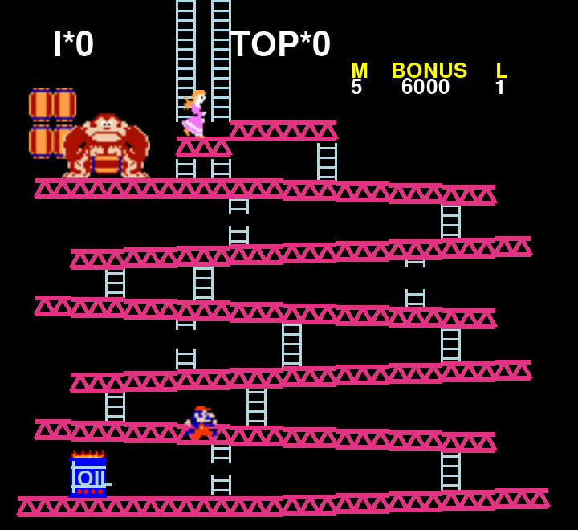
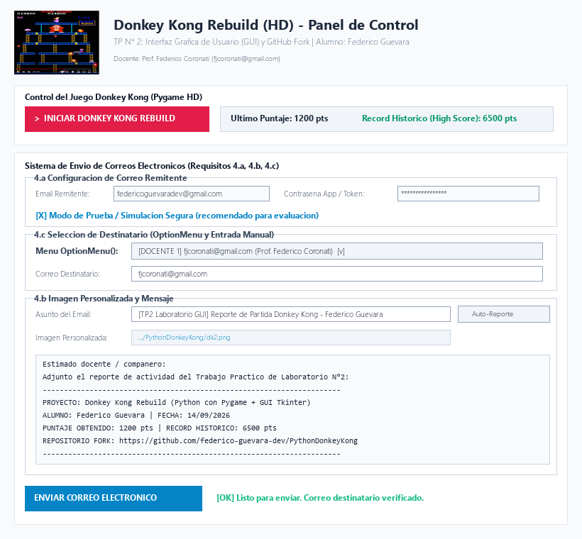

# Trabajo Práctico de Laboratorio N°2: Interfaz Gráfica de Usuario (GUI) y GitHub Fork

**Materia:** Laboratorio de Programación  
**Docentes:** Prof. Federico Coronati ([fjcoronati@gmail.com](mailto:fjcoronati@gmail.com)) | Prof. Fedullo ([mfedullo@gmail.com](mailto:mfedullo@gmail.com))  
**Alumno:** Federico Guevara  
**Email:** [federicoguevaradev@gmail.com](mailto:federicoguevaradev@gmail.com)  
**Repositorio Original:** [https://github.com/plemaster01/PythonDonkeyKong](https://github.com/plemaster01/PythonDonkeyKong)  
**Fork del Proyecto:** [https://github.com/federico-guevara-dev/PythonDonkeyKong](https://github.com/federico-guevara-dev/PythonDonkeyKong)  

---

## 1. Objetivo del Trabajo Práctico

El objetivo principal de este trabajo práctico consiste en:
1. Tomar un proyecto de código abierto existente con Interfaz Gráfica de Usuario (GUI) en Python desde GitHub.
2. Realizar un **Fork (bifurcación)** legítimo hacia la cuenta personal de GitHub para preservar autoría original y permitir contribuciones futuras.
3. Clonar el repositorio localmente, comprobar y depurar su funcionamiento.
4. Aplicar modificaciones sustanciales a la interfaz gráfica y funciones del sistema (remitente de email, imágenes personalizadas, selector de destinatarios con `OptionMenu()` y entrada manual).
5. Compilar un archivo ejecutable autónomo (`.exe` para Windows) alojado en la carpeta `output/`.
6. Diseñar un informe progresivo en este archivo `README.md` documentando las modificaciones en cada commit.
7. Mantener un historial de al menos 4 commits descriptivos en Git y sincronizarlos con GitHub.

---

## 2. Proyecto Base Seleccionado

Se seleccionó una reconstrucción completa en Python con Pygame del clásico juego arcade **Donkey Kong**. El repositorio fue bifurcado correctamente a la cuenta del alumno:
`https://github.com/federico-guevara-dev/PythonDonkeyKong`.

---

## 3. Modificaciones Fase 1: Motor Gráfico, Sprites HD y Rutas

En este primer hito de desarrollo se aplicaron mejoras sustanciales a la base del juego en `main.py`:
- **Optimización de Sprites con Smoothscale Bilineal:** El código original utilizaba `pygame.transform.scale()`, produciendo pixelado aserrado al reducir los sprites de 1440x1440 px. Se implementó `pygame.transform.smoothscale()` con filtrado bilineal y canal alfa `.convert_alpha()`, logrando que Donkey Kong, Mario, barriles, fuego, martillos y Peach se visualicen en alta definición (HD) con bordes suaves.
- **Resolución Adaptable:** Se ajustaron las dimensiones a 720x660 px con escala proporcional de secciones (`section_width`, `section_height`, `slope`) para adaptarse tanto a pantallas de netbooks escolares como a monitores estándar.
- **Rutas Relativas Dinámicas con PyInstaller:** Implementación de la función `resource_path()` para resolver recursos dinámicamente tanto en modo desarrollo como empaquetado (`sys._MEIPASS`).
- **Modularización del Loop de Juego:** Se encapsuló la lógica del juego en la función `run_game(existing_high_score)` retornando puntuaciones finales para su posterior integración con la GUI de Tkinter.

### Captura de Pantalla: Donkey Kong Rebuild (Sprites HD)


---

## 4. Modificaciones Fase 2: Interfaz Gráfica Tkinter y Sistema de Correos

Para dar cumplimiento a los puntos 4.a, 4.b y 4.c del trabajo práctico, se desarrolló un módulo completo de interfaz gráfica en Tkinter (`gui_launcher.py`):

### 4.a Configuración de Correo Electrónico Remitente
- Implementación de campos para la cuenta emisora (`federicoguevaradev@gmail.com`) y contraseña de aplicación SMTP.
- Se incorporó un **Modo de Prueba / Simulación Segura**, permitiendo validar el paquete MIME y simular envíos sin necesidad de ingresar contraseñas personales en computadoras compartidas de la escuela.
- Soporte de envíos en vivo mediante protocolo seguro `smtplib` con SSL/TLS (`smtp.gmail.com:465`).

### 4.b Inserción de Imágenes Personalizadas
- **Banner Gráfico:** Se insertó la imagen personalizada `dk2.png` en el encabezado del panel de control de Tkinter mediante `tk.PhotoImage` con escalado proporcional.
- **Adjunto de Imágenes:** Selector con `filedialog` que permite adjuntar imágenes personalizadas a los correos electrónicos mediante la clase `MIMEImage`.

### 4.c Menú de Destinatarios con OptionMenu() y Entrada Manual
- Se integró el widget requerido `OptionMenu()` con las siguientes opciones predefinidas:
  - `[DOCENTE 1] fjcoronati@gmail.com (Prof. Federico Coronati)` *(Preseleccionado por defecto)*
  - `[DOCENTE 2] mfedullo@gmail.com (Prof. Fedullo)`
  - `[DOCENTE 3] docente3.programacion@escuela.edu.ar (Docente Programación 3)`
  - `[PROPIO] federicoguevaradev@gmail.com (Email del Alumno)`
  - `[COMPAÑERO] companero1.informatica@escuela.edu.ar`
  - `[OTRO] Escribir otro correo manualmente en el campo inferior...`
- **Campo Entry Sincronizado:** Al seleccionar un destinatario del `OptionMenu()`, el campo `Entry` se actualiza automáticamente. Si se selecciona "Otro", el campo se limpia y enfoca para permitir tipear cualquier dirección manual. El sistema toma siempre el correo escrito en este campo para el envío.
- **Auto-Generador de Reportes:** Botón para redactar automáticamente un reporte formal con fecha, hora, autor, puntaje y enlace al fork de GitHub.

### Captura de Pantalla: Panel GUI Tkinter con OptionMenu y Banner


---

## 5. Modificaciones Fase 3: Integración de Módulos y Script de Inicio

En esta fase se implementó la conexión bidireccional entre la interfaz gráfica Tkinter y el juego en Pygame:
- **Control de Ciclo de Vida:** Al hacer clic en `▶ INICIAR DONKEY KONG REBUILD`, la ventana de Tkinter se oculta limpiamente (`root.withdraw()`). Pygame se inicializa y ejecuta la partida. Al terminar (vidas agotadas o tecla ESC), Pygame se cierra de forma segura y Tkinter vuelve a primer plano (`root.deiconify()`).
- **Sincronización de Puntuaciones:** La GUI actualiza en tiempo real el último puntaje y el récord histórico (*High Score*). Además, actualiza automáticamente el cuerpo del correo con el reporte de la partida recién jugada.
- **Acceso Directo para Windows (`iniciar.bat`):** Creación de un archivo batch que permite iniciar la aplicación completa con un solo clic, gestionando automáticamente el intérprete de Python en Windows.

### Instrucciones de Ejecución desde Código Fuente
1. Instalar dependencias:
   ```bash
   pip install pygame
   ```
2. Iniciar la aplicación:
   ```bash
   # Opción 1: Mediante el script automático
   iniciar.bat

   # Opción 2: Mediante Python
   python main.py
   ```

---

## 6. Historial de Commits (Bitácora de Desarrollo)

| N° | Commit | Descripción |
|:---:|---|---|
| **1** | `feat: optimizacion de sprites con smoothscale y documentacion inicial en README` | Carga de sprites en alta definición con filtrado bilineal y canal alfa; resolución adaptable a netbooks escolares e inicio del informe README.md. |
| **2** | `feat: interfaz Tkinter con OptionMenu de destinatarios y actualizacion de README` | Creación de `gui_launcher.py` con `OptionMenu()`, `Entry` manual, configuración SMTP, banner `dk2.png` y actualización del informe en README.md. |
| **3** | `feat: integracion de lanzador con Pygame, script iniciar.bat y registro en README` | Conexión bidireccional entre Tkinter y Pygame con actualización de puntuaciones, script `iniciar.bat` y guía de ejecución en README.md. |
